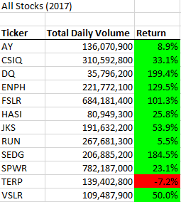

# stock-analysis

## Overview of Project
The project refactors the module 2 solution code by using functions such as For, IF, Array, and Loop. The codes efficiently run through all stocks to calculate the trading volume and return by ticker. It also is uswer friendly by having input message box and runtime message to help the user understand what was done with how much time. 

## Results : Using images and examples of your code, compare the stock performance between 2017 and 2018, as well as the execution times of the original script and the refactored script.

#### Stock Performance Comparison Between 2017 and 2018

As shown in the images below, 

		

## Summary
#### What are the advantages or disadvantages of refactoring code?
#### How do these pros and cons apply to refactoring the original VBA script?
